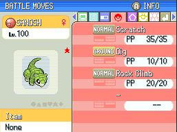

# plat-qol
C Injection Pokemon Platinum repository intended to be used in tandem with Following Platinum to create a number of Quality of Life changes that enhance the gameplay experience.

# Features:

- Unlimited TM's

 

- HM Usage based on possession

 

  

 

- Pressing B toggles autorun

 

- [ ] Faster surfing speed
- [ ] Faster text printing
- [ ] Faster HP bar drain
- [ ] Press B to select RUN in wild battles

# Contributing
DM me on Discord (BluRose#0412)

# Install
Pending more detailed instructions.  Really only works on Windows through WSL at the moment, may look to change that eventually but I can't be bothered.

# Credits
* [**Skeli (FR template)**][CFRU]
* [**CodenamePU (NARC tool)**][G5T]
* [**Mikelan98, Nomura (ARM9 Expansion Subroutine )**][ARM9]
* Rafael Vuijk (Nintendo DS rom tool)
* [**pret/pokediamond**][pret]
* [**JimB16/PokePlat**][pokeplat]
* [**Bubble791 for base repo**]

[CFRU]: https://github.com/Skeli789/Complete-Fire-Red-Upgrade
[G5T]: https://github.com/CodenamePU/Gen5Tools
[ARM9]: https://pokehacking.com/tutorials/ramexpansion/
[pret]: https://github.com/pret/pokediamond
[pokeplat]: https://github.com/JimB16/PokePlat
